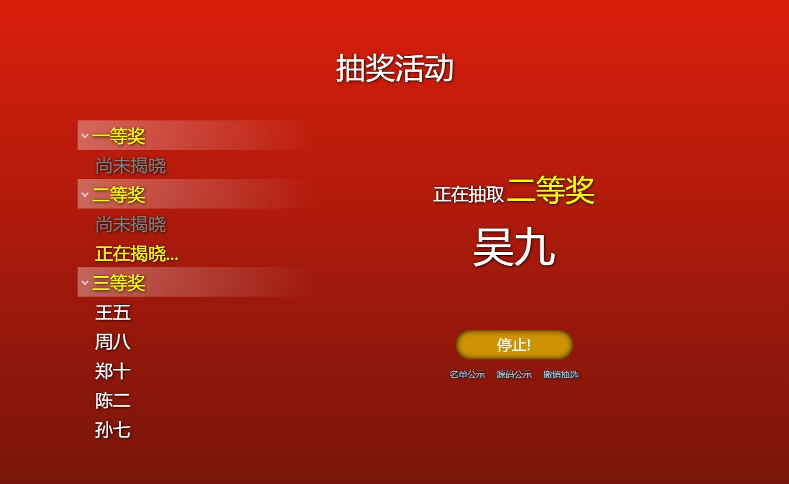

# NyarukoLuckDraw

一个抽奖网页，可用于年会抽奖等场合。可以自定义：

1. 奖项
2. 每个奖项的可获奖人数
3. 抽奖音频
4. 视频背景
5. 字体
6. 名单公示开关等

## 环境需求

1. 有一个 Web 服务，仅需要静态网页服务。
2. 需要有 `python3`, `nodejs`, `npm` 。

## 安装和运行

1. 将本仓库克隆到需要的位置。
2. 进入克隆好的文件夹。
3. 执行 `git submodule init` 和 `git submodule update --remote` 下载子模块依赖。
4. 执行 `npm install` 下载 NPM 依赖。
5. 根据 `data.example.json` 文件的示例内容，进行配置的修改以后，存储到 `./data.json` 。你需要配置：
   1. 活动标题 `title`
   2. 抽奖过程中播放的音频文件相对路径（建议 mp3 格式，可留空） `se_audio`
   3. 作为网页背景图的视频文件相对路径（建议 mp4 格式，可留空） `bg_video`
   4. 每个奖项的名称和每个奖项分别有多少人可以获得 `prize`
   5. 参与者名单 `list`
   6. 是否公示名单 `publiclist` (`1`或`0`)
   7. 是否显示 Github 链接等关于信息 `githublink` (`1`或`0`)
   8. 是否允许撤销抽选 `undo` (`1`或`0`)
6. 创建两个新的文件夹 `dist` 和 `fonts` 。
7. （可选）可以将一个字体问题放置为 `./fonts/webfont.ttf` ，网页将使用这个字体。在执行 `npm run release` 后才会应用，编译时会将这个字体压缩，只保留需要的字符。
8. 运行 `npm run debug` ，显示 `compiled successfully` 即可。如果在 Windows 系统中编译脚本的 `cp`, `rm` 等命令出错，可以安装 `msys64` 并将 `msys64\usr\bin` 添加到环境变量 `PATH` 。
9. 访问该 Web 服务中该路径的网址。不要直接本地双击 `index.html` ，浏览器会出现 `CORS policy` 错误。

## 快捷键

| 按键 | 功能           |
| ---- | -------------- |
| 回车 | 开始或停止抽选 |
|  l   | 列出参与者名单 |
|  u   | 撤销一次抽奖   |

## 截图

截图中未配置背景视频和自定义字体。

## LICENSE

Copyright (c) 2021 神楽坂雅詩 NyarukoLuckDraw is licensed under Mulan PSL v2. You can use this software according to the terms and conditions of the Mulan PSL v2. You may obtain a copy of Mulan PSL v2 at: http://license.coscl.org.cn/MulanPSL2 THIS SOFTWARE IS PROVIDED ON AN "AS IS" BASIS, WITHOUT WARRANTIES OF ANY KIND, EITHER EXPRESS OR IMPLIED, INCLUDING BUT NOT LIMITED TO NON-INFRINGEMENT, MERCHANTABILITY OR FIT FOR A PARTICULAR PURPOSE. See the Mulan PSL v2 for more details.
